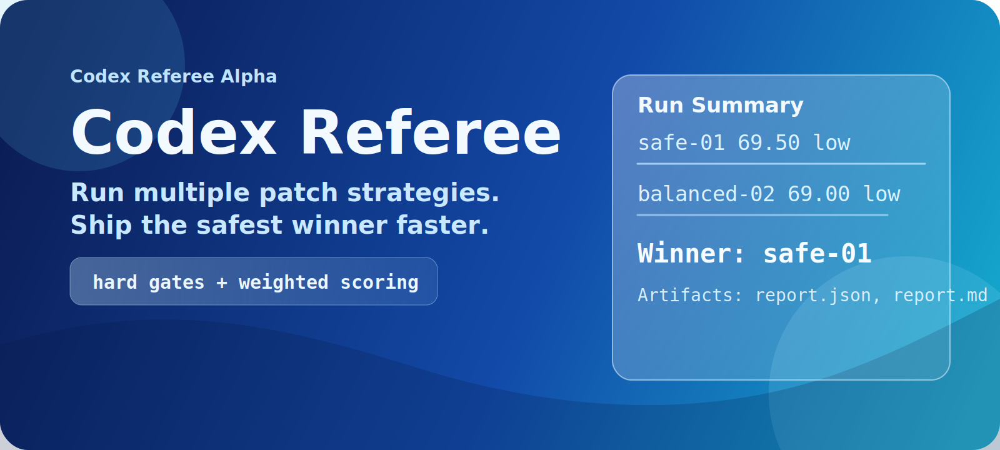
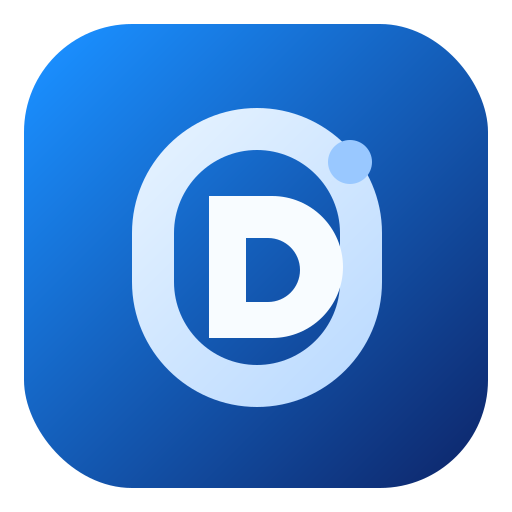

<p align="center">
  
</p>

<p align="center">
  
</p>

<h1 align="center">Codex Referee</h1>

<p align="center">
  Run multiple AI patch strategies, score them with hard gates, and ship the safest winner with full artifacts.
</p>

<p align="center">
  Built for individual ChatGPT Pro + Codex users who want faster, safer code decisions.
</p>

## Why Use It

1. Get better first-pass patch quality by comparing multiple strategy outputs.
2. Reduce bad merges with explicit hard gates and risk-aware scoring.
3. Save review time with one ranked recommendation instead of manual diff triage.
4. Keep every run auditable through generated artifacts (`execution`, `eval`, `score`, `report`).
5. Stay consistent across random tasks, fun projects, and serious production work.

## Current Scope

- End-to-end `referee run` vertical slice is implemented.
- Strategy flow: isolated worktree per strategy -> placeholder execution -> evaluation -> ranking -> winner.
- Artifacts: `diff.patch`, `execution.json`, `eval.json`, `score.json`, `report.json`, `report.md`.
- Strict quality gates active: `format`, `lint`, `typecheck`, `test`, `build`.

## Quick Start

Requirements:

- Node `24.x`
- `pnpm` `10.x`
- `git`

Install and validate:

```bash
pnpm install
pnpm format
pnpm lint
pnpm typecheck
pnpm test
pnpm build
```

Run a tournament:

```bash
pnpm --filter @referee/cli dev -- run \
  --task "add retry logic to api client" \
  --repo /path/to/repo \
  --strategies "safe,balanced,aggressive" \
  --max-parallel 3
```

## Example Output

```text
Run 20260225-203558-ibr6: winner safe-01 (69.50, low)
Artifacts: /path/to/repo/runs/20260225-203558-ibr6
```

## Artifact Layout

```text
runs/<run-id>/
  report.json
  report.md
  candidates/
    <strategy>/
      diff.patch
      execution.json
      eval.json
      score.json
  worktrees/
    <strategy>/
```

## Monorepo Packages

- `@referee/core`: canonical domain contracts.
- `@referee/git`: worktree lifecycle and diff metadata.
- `@referee/runner`: strategy execution adapters.
- `@referee/eval`: gates and metric normalization.
- `@referee/rank`: weighted scoring and winner selection.
- `@referee/report`: markdown and summary rendering.
- `@referee/schemas`: zod runtime validation contracts.
- `@referee/store`: persistence layer (next milestone).
- `@referee/cli`: command entrypoint and policy enforcement.

## Policy

The project enforces an endgame optimization rule set:

- No shortcut implementation without explicit replacement plan.
- Auditable decision outputs are mandatory.
- Policy override is explicit and guarded at runtime.

References:

- `docs/product/ENDGAME-OPTIMIZATION-MANDATE.md`
- `references/optimization-policy.json`

## Roadmap

1. Implement persistence (`@referee/store`) and run index.
2. Implement `inspect`, `accept`, and `feedback` commands.
3. Add learning loop from accept/reject outcomes.
4. Add CI workflows for affected-only checks.

## Development Workflow

```bash
pnpm format
pnpm lint
pnpm typecheck
pnpm test
pnpm build
```

For session continuity and decision history:

- `docs/handoff/00-START-HERE.md`
- `docs/handoff/01-CURRENT-STATE.md`
- `docs/handoff/02-NEXT-PROMPT.md`
- `docs/decisions/DECISION-LOG.md`
- `logs/SESSION-LOG.md`
